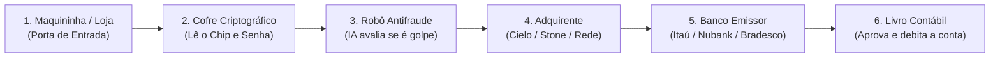

# ARKHÉ: O "RADAR ANTI-COLISÃO" DOS SISTEMAS DIGITAIS
### Entenda de forma simples como uma nova tecnologia prevê e impede quedas em sistemas de pagamentos e internet antes que elas aconteçam

---

## 1. O que é o ARKHÉ em uma frase?

> **O ARKHÉ é para os sistemas de computador o que o piloto automático anti-colisão é para os carros modernos:** ele enxerga o perigo minutos antes do impacto, avisa a equipe e desvia o trânsito sozinho para que ninguém fique na mão.

---

## 2. A Metáfora do Mundo Real: A Ambulância vs. O Sensor Inteligente

Imagine que você está dirigindo em uma rodovia com neblina:

* **Como as ferramentas tradicionais de tecnologia funcionam hoje (a "Ambulância"):**  
  Elas são como uma ambulância parada no acostamento esperando o acidente acontecer. Quando dois caminhões batem e a rodovia inteira fica travada por 3 horas, a sirene toca: *"Atenção, houve uma batida!"*. Isso é o que ferramentas famosas como Datadog, Dynatrace ou alarmes de TI fazem. Elas são excelentes para contar o tamanho do prejuízo **depois** que o sistema já caiu.

* **Como o ARKHÉ funciona (o "Sensor Anti-Colisão com Piloto Automático"):**  
  O ARKHÉ não espera a batida. Ele tem um radar inteligente que percebe quando um carro a 300 metros à frente começou a frear de forma estranha e a pista está escorregadia. Ele calcula em segundos: *"Nessa velocidade e com esse fluxo, se nada for feito, haverá um engavetamento em 6 minutos"*. E mais: ele aciona suavemente o freio e desvia para a pista lateral automaticamente.

---

## 3. Qual é a dor que o ARKHÉ resolve?

Todos nós já passamos por situações irritantes na internet:
- Tentar pagar um almoço no cartão ou Pix e a maquininha ficar girando até dar *"Transação não autorizada / Erro de comunicação"*.
- Tentar comprar um ingresso concorrido ou aproveitar uma promoção na Black Friday e o site simplesmente travar na tela de pagamento.
- Tentar abrir o aplicativo do banco no dia do pagamento e ver a mensagem *"Serviço temporariamente indisponível"*.

### Por que isso acontece tantas vezes se as empresas investem milhões em tecnologia?
Porque nos bastidores, um sistema de pagamentos não é um computador só. É uma fila gigantesca de vários computadores conversando entre si em frações de segundo.

O grande problema é que **uma lentidão minúscula em um único computador vira uma bola de neve incontrolável**:
1. Se uma etapa que demorava meio segundo passa a demorar 1 segundo, as mensagens começam a se acumular.
2. O cliente acha que travou e clica várias vezes no botão *"Pagar"*.
3. O aplicativo do celular tenta reenviar o pedido 3 ou 4 vezes.
4. De repente, uma fila de 1.000 pessoas se transforma em um "efeito manada" de 10.000 pedidos ao mesmo tempo.
5. O sistema engasga, o servidor esgota a memória e **tudo cai**.

As ferramentas comuns de monitoramento são cegas para esse início da bola de neve. Elas só apitam quando os servidores já estão pegando fogo.

---

## 4. O Efeito "Pedágio": Como o ARKHÉ Funciona na Prática?

Para entender a matemática do ARKHÉ sem precisar ser engenheiro, pense em uma **praça de pedágio em uma rodovia**:

```
[ Carros Chegando ]  --->  [ Cabines de Pedágio ]  --->  [ Viagem Segue Livre ]
    (Tráfego)                 (Capacidade)                  (Sucesso)
```

- Imagine que o pedágio tem **10 cabines abertas**.
- Cada carro leva **10 segundos** para pagar e passar.
- Enquanto chegam 10 carros por minuto, tudo flui em linha reta, sem fila nenhuma.

### O momento em que o desastre começa (e ninguém vê):
De repente, a operadora do pedágio começa a ter problemas na maquininha de cartão. O tempo de atendimento sobe de **10 segundos para 30 segundos**.

1. **A cegueira dos sistemas normais:**  
   Como os carros ainda estão passando (só um pouco mais devagar), os alarmes tradicionais acham que está tudo bem. A placa continua verde.
2. **A visão do ARKHÉ:**  
   O ARKHÉ não olha se o carro passou ou não; ele olha a **velocidade com que a fila está crescendo**. Pela física de filas (uma lei matemática descoberta há mais de 60 anos chamada *Lei de Little*), o ARKHÉ calcula:  
   *"A essa taxa de chegada, em 4 minutos as cabines não darão conta e a fila vai transbordar para a rodovia, travando os motoristas por quilômetros"*.

O ARKHÉ avisa com **minutos de antecedência**:
> *"Alerta! Não espere o trânsito parar. A fila vai estourar daqui a 5 minutos!"*

---

## 5. Como uma Transação de Cartão Acontece em 1 Segundo?

Para entender por que o ARKHÉ foi testado em um ambiente de cartões de crédito, veja o que acontece em apenas **meio segundo (500 milissegundos)** toda vez que você aproxima seu cartão ou celular na maquininha:



1. **Porta de Entrada (Gateway):** Recebe o sinal da maquininha da loja.
2. **Cofre de Segurança (HSM):** Uma caixa física ultra-segura que descriptografa a senha e o chip do cartão.
3. **Robô Antifraude:** Um cérebro de inteligência artificial que avalia em 50 milissegundos se aquela compra combina com você ou se parece com um golpe.
4. **Adquirente (A rede):** Leva a transação até a bandeira (Visa, Mastercard, Elo).
5. **Seu Banco (O Emissor):** Abre seu saldo e verifica se você tem limite disponível.
6. **Livro Contábil:** Registra a compra e manda de volta o famoso *"Bip - Aprovado"*.

Se o **Robô Antifraude** ou o **Cofre de Senhas** engasgarem por apenas 200 milissegundos a mais, milhares de compras do Brasil inteiro começam a empilhar no mesmo segundo.

---

## 6. O que faz o ARKHÉ ser diferente de tudo que existe no mercado?

| Situação | Ferramentas Tradicionais (Datadog, Dynatrace, Logs) | O Que o ARKHÉ Faz |
| :--- | :--- | :--- |
| **Como enxergam o sistema** | Ficam lendo milhares de linhas de texto (logs) que os programas cospem. É como tentar saber se alguém vai enfartar lendo o diário dela. | Monitora os sinais vitais do sistema (pressão, fluxo e batimento cardíaco da fila). |
| **Quando avisam** | **Depois que o cliente tomou erro.** O cliente vê a tela vermelha primeiro, o engenheiro recebe a mensagem depois. | **Antes do cliente notar.** Avisa enquanto tudo ainda parece normal aos olhos humanos. |
| **Privacidade e Segurança (PCI-DSS)** | Para investigar um erro, muitas vezes gravam textos que podem conter dados do cliente sem querer. | **Totalmente cego aos dados do cartão.** Ele só mede o peso e o movimento do tráfego, sem nunca abrir o pacote para ver o que tem dentro. |
| **O que fazem quando o alarme toca** | Mandam uma mensagem assustadora no Slack ou celular dos engenheiros: *"Corram, o sistema caiu!"*. | **Age sozinho em fração de segundo:** abre novas pistas, desvia o tráfego leve para um atalho e salva a operação sem precisar acordar ninguém de madrugada. |

---

## 7. A Prova do Laboratório: O Que Aconteceu no Teste?

Para comprovar que essa ideia não era apenas uma teoria bonita de papel, colocamos o ARKHÉ em um laboratório de alta fidelidade:

* **O Cenário do Teste:**  
  Simulamos um centro de pagamentos processando **120 compras de cartão a cada segundo**. Isso equivale a mais de **7.000 compras por minuto**.
* **O Teste Cego:**  
  Colocamos o ARKHÉ para disputar lado a lado contra o sistema de monitoramento tradicional que as maiores empresas do mundo usam hoje.
* **O Ataque de Caos:**  
  Injetamos uma lentidão artificial no robô antifraude para fazer a fila começar a subir.

### O Resultado Real e Inquestionável:

```
[ Início da Lentidão ] -----------------------------------------------> [ Colapso Total ]
       |                                                                        |
       |---> ARKHÉ percebe aos 15 segundos!                                    |
             (Gera 6 a 7 MINUTOS de aviso prévio)                              |
                                                                                |
                                                   SRE Tradicional NÃO VIU NADA!|
                                                   (Ficou cego até o final) <---|
```

1. **A Cegueira do Sistema Antigo:**  
   O monitoramento tradicional **nem sequer percebeu que havia um desastre a caminho**. Como as transações ainda estavam passando (embora acumulando fila nos bastidores), ele continuou com a luz verde acesa.
2. **A Visão do ARKHÉ:**  
   Em apenas **15 segundos**, o ARKHÉ percebeu a aceleração da curva matemática e avisou:  
   *"Atenção! A esteira entrou em rota de colapso. Restam poucos minutos até travar tudo!"*.
3. **A Vantagem Conquistada:**  
   O ARKHÉ deu **6 minutos e 5 segundos de antecedência média**.
4. **A Autocura em Ação:**  
   Quando ligamos o modo automático do ARKHÉ, ele não esperou ninguém responder. Ele **dobrou a capacidade das cabines na hora** e mandou 70% das compras seguras por uma "faixa expressa".  
   **O resultado final:** Nem uma única compra foi perdida, nenhuma maquininha deu erro e o sistema passou pelo teste com **100% de aprovação**.

---

## 8. Por Que Isso Funciona? A Ciência por Trás da Ideia

Não existe mágica nem adivinhação mística no ARKHÉ. Ele funciona com base em princípios comprovados da física e da matemática:

1. **Nada colapsa do nada:**  
   Assim como uma ponte não desaba de repente sem antes ranger e dilatar sua estrutura milímetro a milímetro, um sistema de computadores não trava sem antes alterar a forma como as filas se comportam. O ARKHÉ é o aparelho que escuta o "ranger da ponte".
2. **A Janela de Determinismo:**  
   Depois que o sistema cai, vira um caos impossível de prever: mensagens perdidas, conexões cortadas, pessoas furiosas teclando F5 sem parar.  
   Mas **antes de cair**, o comportamento obedece à física pura das filas. É exatamente nessa janela previsível que o ARKHÉ atua com precisão cirúrgica.

---

## 9. O Impacto no Mundo dos Negócios

Para uma grande rede de varejo, um banco ou uma empresa de maquininhas:
- **6 minutos de antecedência** é tempo de sobra para computadores criarem novas instâncias na nuvem, desviarem rotas de tráfego e absorverem picos de venda.
- Evita o prejuízo direto de vendas perdidas no caixa.
- Evita a temida notícia de jornal: *"Aplicativo do banco tal fica fora do ar em pleno quinto dia útil"*.
- Economiza milhões de reais que hoje são gastos arquivando terabytes de logs que ninguém lê a tempo.

### Em Resumo:
O ARKHÉ transforma a computação moderna: **deixa de ser um pronto-socorro que cuida de sistemas feridos para se tornar um escudo protetor que impede o desastre antes que ele aconteça.**
