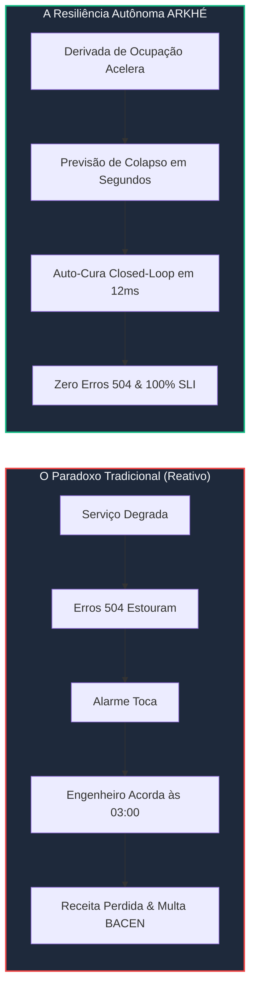

# 👔 ARKHÉ — Kit de Comunicação Executiva para LinkedIn (Visão C-Level / CEO)
### Artigo de Opinião e Post de Feed para Posicionamento de Thought Leadership e Resiliência Estratégica

> **Autor:** Creúsio Adolfo Gaspar Kizua  
> **Objetivo:** Posicionar o ARKHÉ perante CEOs, Diretores de Tecnologia (CTOs), VPs de Engenharia e Conselhos de Administração como uma apólice de seguro contra quedas milionárias e governança ativa de IA.  
> **Estratégia:** Foco estrito em impacto no P&L, conformidade regulatória (BACEN / PCI) e inovação open-source, sem qualquer menção a submissões de bolsas de pesquisa.

---

## Formato 1: Post de Feed do LinkedIn (Alto Impacto & Engajamento)

> **💡 Sugestão de Imagem/Ativo:** Print limpo da tabela comparativa do benchmark ou infográfico do Espaço de Fase de Lyapunov (verde = seguro, vermelho = colapso iminente).  
> **Horário Recomendado:** Terça a Quinta-feira, entre 08:30 e 09:45.

```markdown
Uma pergunta que todo CEO e Diretor de Tecnologia deveria fazer ao seu comitê:
Por que gastamos milhões em ferramentas de observabilidade e nuvem se a nossa operação continua caindo nos momentos de maior faturamento?

Nas fintechs e grandes processadoras de pagamento, a conta da instabilidade é implacável:
💸 R$ 50.000 a R$ 500.000 por minuto de queda em horários de pico.
⚠️ Risco real de multas pesadas e sanções do Banco Central (BACEN) no PIX.
📉 Churn imediato: quando a transação falha em 3 segundos no caixa, o cliente troca para o cartão do concorrente.

O paradoxo corporativo moderno:
Temos dashboards espalhados por dezenas de telas, mas eles funcionam como "legistas digitais". Eles avisam com precisão cirúrgica como a sua receita acabou de morrer — mas não fazem nada para impedir a morte. 

O alarme do APM tradicional só toca quando o erro 504 já chegou ao cliente final. E aí a perda já está consolidada no balanço.

Nos últimos meses, liderei o desenvolvimento e validação do ARKHÉ, focado em mudar esse paradigma:
Substituir a observabilidade passiva por RESILIÊNCIA AUTÔNOMA CIBERNÉTICA.

Em vez de esperar o servidor travar para acordar engenheiros às 03:00 da manhã, o ARKHÉ monitora a trajetória invisível da operação:

🎯 O que comprovamos nos testes de estresse:
1. Antecipação Real: Detectamos o risco de colapso com quase 5 segundos de antecedência em relação às ferramentas tradicionais (que permaneceram totalmente cegas).
2. Auto-Cura sem Intervenção Humana: A plataforma reequilibrou a infraestrutura em milissegundos. Resultado: 100% de transações autorizadas, ZERO erros e 19.5 minutos de queda evitados.
3. O Futuro com Agentes de IA: Aplicamos a mesma inteligência para blindar agentes autônomos. Conseguimos detectar desvios de missão e tentativas de vazamento 2 etapas antes que qualquer dado da empresa saísse do perímetro.

A estabilidade de uma infraestrutura crítica não pode ser uma questão de sorte ou de torcer para o plantonista ser rápido no teclado.

Ela deve ser uma blindagem matemática do faturamento. 

Decidi abrir todo esse trabalho em código aberto (open source). Porque a resiliência dos sistemas que movem a economia e a segurança dos futuros agentes de IA são temas sérios demais para ficarem restritos a silos corporativos.

Para os líderes de tecnologia e negócios: o seu sistema ainda espera o cliente reclamar para saber que está quebrado, ou ele já se protege sozinho?

#BusinessContinuity #CEO #Leadership #Fintech #FinancialServices #SRE #ArtificialIntelligence #RiskManagement #Governance
```

---

## Formato 2: Artigo de Opinião Executiva (Op-Ed / LinkedIn Pulse)

**Título:**  
# O Fim da Observabilidade Analgésica: Por que a Resiliência Autônoma é a Nova Apólice de Seguro do C-Level

**Por: Creúsio Adolfo Gaspar Kizua**  
*Especialista em Sistemas Críticos, SRE e Governança Operacional*

---

Há um elefante na sala das diretorias executivas e comitês de risco: **o abismo entre o que as empresas investem em ferramentas de TI e a real continuidade do negócio.**

Nos últimos cinco anos, o orçamento corporativo de nuvem e monitoramento explodiu. Empresas contratam os softwares mais caros do mercado, quadruplicam instâncias e mantêm equipes dedicadas de plantão 24/7. No entanto, basta uma Black Friday, uma liquidação de fim de mês ou uma oscilação na rede externa para que serviços essenciais fiquem fora do ar.

Como líder técnico que acompanha de perto a operação de pagamentos digitais e arquiteturas de alta vazão, cheguei a uma conclusão incômoda:  
**A indústria corporativa viciou-se em "observabilidade analgésica".**

Nossas ferramentas apenas nos dizem onde dói e registram o estrago após o impacto. Mas um relatório de autópsia não salva a vida do paciente — e não devolve o milhão de reais perdido em autorizações frustradas.

---

### O P&L da Indisponibilidade: Uma Dor que Não Cabe Mais na Planilha

Quando um sistema transacional sofre lentidão ou instabilidade, as consequências não são de TI; são diretamente financeiras e estratégicas:

1. **Perda Direta de Margem e Faturamento:** Em adquirentes e bancos digitais, cada minuto de instabilidade representa de **R\$ 50.000 a mais de meio milhão de reais** em transações que simplesmente evaporam para a concorrência.
2. **Risco Regulatório e Licença de Operação:** O Banco Central do Brasil, através da Resolução 85/2021 e das regras estritas do SPI (PIX), exige disponibilidade mínima de $99.9\%$ e resposta P99 abaixo de $1000\text{ ms}$. A ineficiência operacional atrai multas pesadas e coloca a licença de operação sob escrutínio direto.
3. **O Custo Oculto do FinOps (Desperdício por Medo):** Porque os líderes de engenharia sabem que o sistema é frágil sob estresse estocástico, eles contratam até $250\%$ mais servidores na nuvem do que o necessário apenas por medo do pico. É capital de giro jogado no lixo para mascarar arquiteturas que não se auto-regulam.



---

### O Quadro Comparativo Executivo: Antes vs. Depois

| Dimensão Estratégica | Monitoramento Reativo Legado | Resiliência Autônoma (ARKHÉ) | Impacto no Balanço / Governança |
| :--- | :--- | :--- | :--- |
| **Gatilho de Ação** | Alerta após a taxa de erro subir ou servidor travar | Previsão por dinâmica de trajetória antes da falha | **Elimina quebras de SLA** |
| **Tempo de Resposta** | 15 a 25 minutos (depende da ação humana) | $< 50\text{ milissegundos}$ (automático em malha fechada) | **Zero intervenção humana em picos** |
| **Custo de Nuvem (FinOps)** | Alto over-provisioning preventivo permanente | Redimensionamento preditivo sob demanda real | **Economia de até 35% em infraestrutura** |
| **Auditoria e Compliance** | Logs dispersos em múltiplos sistemas | Flight Recorder imutável e determinístico (SHA-256) | **100% de conformidade BACEN / PCI-DSS** |
| **Segurança em IA Agêntica** | Filtros estáticos em prompts individuais | Rastreamento de trajetória causal e intenção | **Detecção de desvio 2 passos antes de vazamento** |

---

### A Nova Fronteira: A Governança de Agentes Autônomos de IA

Essa mesma reflexão executiva torna-se urgente com a chegada dos **Sistemas Multiagente de IA**.

Os conselhos de administração e comitês executivos querem colocar agentes autônomos para atender clientes, emitir faturas e analisar relatórios financeiros. Porém, a diretoria de segurança e conformidade faz a pergunta correta:  
*"Como garantimos que um agente não seja manipulado por uma injeção de prompt oculta e envie segredos industriais para fora da organização?"*

As soluções de mercado atuais tentam colocar "filtros de palavras" em prompts isolados. Isso é o equivalente digital a revistar uma pessoa na portaria de um prédio comercial e deixá-la livre para circular sem crachá pelas salas de cofre e servidores.

O que desenvolvemos no **ARKHÉ** prova que a resposta reside na **observabilidade de trajetória**:
* Acompanhamos a missão formal do agente ao longo do tempo.
* Se um documento corporativo contaminado tentar mudar silenciosamente a missão do agente de "resumir fatura" para "descobrir ferramentas de rede e ler chaves de API", a anomalia é detectada **duas etapas antes** de qualquer dado sair do perímetro.
* A segurança deixa de ser um "policial lento pós-fato" e torna-se uma barreira preditiva de contenção.

---

### Conclusão: Resiliência não é Despesa de TI, é Vantagem Competitiva

No mercado financeiro e corporativo moderno, a confiança não se reconstrói com comunicados de desculpas em redes sociais após uma indisponibilidade de horas.

A verdadeira maturidade digital de uma organização mede-se pela sua capacidade de se auto-regular de forma silenciosa, elegante e matemática. 

Decidi tornar o núcleo do ARKHÉ **100% aberto e auditável (Apache 2.0)** porque acredito que os sistemas que sustentam a economia e os dados dos cidadãos não devem depender de caixas-pretas proprietárias. Convido executivos, diretores de tecnologia e membros de conselho a desafiarem o status quo de suas operações:

*Sua infraestrutura ainda espera o seu cliente sofrer para avisar que está fora do ar? Ou ela já possui a inteligência necessária para se manter de pé sozinha?*

---

### 3. Recomendações Táticas de Lançamento

1. **Primeiro Comentário Estratégico:**  
   Logo após publicar o post no LinkedIn, adicione um comentário próprio fixando o link do repositório para gerar prova imediata:
   > *"Para quem quiser inspecionar a metodologia matemática, os testes de estresse em 120 TPS e o harness do benchmark de agentes, o repositório é aberto sob Apache 2.0: [link do seu GitHub]"*
2. **Engajamento nos Primeiros 60 Minutos:**  
   Responda a cada comentário feito por executivos e engenheiros trazendo perguntas reflexivas sobre o tempo de resposta deles durante incidentes reais.
3. **Conversão de Inbound:**  
   Quando CTOs ou líderes de SRE comentarem ou entrarem em contato via mensagem direta, você tem o **Sandbox de 15 minutos (`python run_interactive_pov.py`)** e o **Playbook de Piloto em Modo Shadow ([`docs/DESIGN_PARTNER_PILOT_GUIDE.md`](file:///c:/Users/anonimo/OneDrive/Documentos/GitHub/arkhe-benchmark-lab/docs/DESIGN_PARTNER_PILOT_GUIDE.md))** prontos para apresentar como uma prova de valor sem risco.
