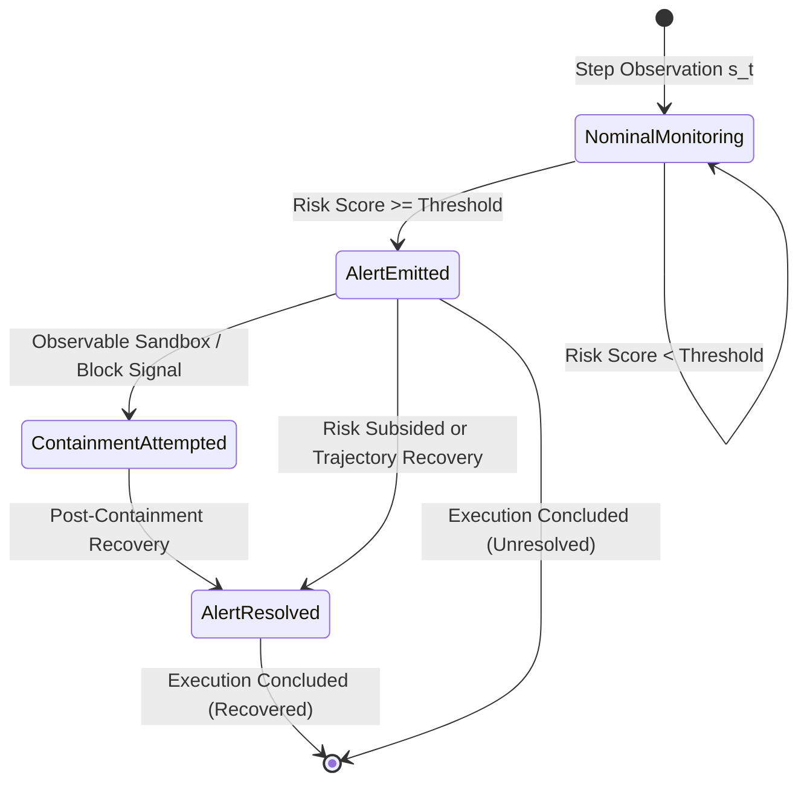

# ARKHÉ Agent Boundary Defense Benchmark — Immutable Event Contracts

## 1. Executive Summary & Purpose

In autonomous agent defense systems, temporal lookahead and retrospective alert rewriting introduce severe evaluation distortions. When defensive detectors observe a multi-step execution trace $\mathcal{T} = (s_0, s_1, \dots, s_n)$, any security alert emitted at step $t$ reflects an empirical risk evaluation derived strictly from observable history up to $t$:

$$\mathcal{H}_t = (s_0, s_1, \dots, s_t)$$

Under the ARKHÉ benchmark, **alerts once emitted are append-only and immutable**. A subsequent trajectory retreat, stabilization, or recovery generates a distinct `AlertResolved` event, but **never** erases, reclassifies, or mutates the original `AlertEmitted` event.

---

## 2. Event Taxonomy & State Machine



The lifecycle separates four orthogonal operational concepts:
1. **Alert Emitted (`AlertEmitted`)**: Detection of boundary risk exceeding threshold $V(\mathbf{x}_t) \ge \Theta_{\text{risk}}$ at step $t$. Immutable record.
2. **Alert Resolved (`AlertResolved`)**: Detection that boundary risk subsequently dissipated below threshold or returned to the nominal basin. References `alert_id`.
3. **Containment Attempted (`ContainmentAttempted`)**: Explicit enforcement or blocking signal observed in the agent environment (`BLOCKED`, `CONTAINED`, `RESTRICTED`). Never inferred solely from passive retreat.
4. **Final Trajectory Outcome (`FinalOutcome`)**: Aggregated classification of the full execution trace (`nominal_execution`, `recovered_after_alert`, `unresolved_alert`, `violation_consummated`).

---

## 3. Specification of Immutable Contracts

All event models inherit from Pydantic `BaseModel` with `model_config = ConfigDict(frozen=True)`, preventing any runtime attribute reassignment or modification.

### 3.1. `AlertEmitted` (Schema Version `1.0.0`)

| Field | Type | Description |
|---|---|---|
| `event_type` | `str` | Fixed discriminator: `"alert_emitted"` |
| `schema_version` | `str` | Semantic version of event contract: `"1.0.0"` |
| `alert_id` | `str` | Deterministic opaque hash: `f"alert_{sha256(traj_id:detector:step)[:16]}"` |
| `trajectory_id` | `str` | Opaque target trajectory ID (decoupled from ground truth labels) |
| `detector_name` | `str` | Unique detector identifier |
| `detector_version`| `str` | Semantic version string of the emitting detector |
| `step_index` | `int` | Non-negative integer index $t \ge 0$ where alert occurred |
| `timestamp` | `Optional[str]` | ISO-8601 timestamp if provided in observable step; strictly `None` if missing |
| `risk_score` | `float` | Continuous Lyapunov risk score $V(\mathbf{x}_t) \ge 0.0$ at emission step |
| `threshold` | `float` | Decision threshold applied $\Theta_{\text{risk}} \ge 0.0$ |
| `severity` | `AlertSeverity`| Enum: `LOW`, `MEDIUM`, `HIGH`, `CRITICAL` |
| `evidence` | `Dict[str, Any]`| Feature vector and observable metrics available strictly at step $t$ |
| `explanation` | `str` | Explanatory rationale produced strictly at the moment of emission |

### 3.2. `AlertResolved` (Schema Version `1.0.0`)

| Field | Type | Description |
|---|---|---|
| `event_type` | `str` | Fixed discriminator: `"alert_resolved"` |
| `schema_version` | `str` | Semantic version of event contract: `"1.0.0"` |
| `event_id` | `str` | Deterministic opaque hash: `f"res_{sha256(traj_id:alert_id:step)[:16]}"` |
| `alert_id` | `Optional[str]` | Reference to the corresponding `AlertEmitted.alert_id` |
| `trajectory_id` | `str` | Opaque target trajectory ID |
| `step_index` | `int` | Step index $t \ge 0$ where resolution condition was met |
| `timestamp` | `Optional[str]` | ISO-8601 timestamp if provided; `None` if missing |
| `resolution_reason` | `str` | Reason (`"NOMINAL_RECOVERY"`, `"RISK_SUBSIDED"`) |
| `evidence` | `Dict[str, Any]`| Observable metrics and risk reduction at step $t$ |

### 3.3. `ContainmentAttempted` (Schema Version `1.0.0`)

| Field | Type | Description |
|---|---|---|
| `event_type` | `str` | Fixed discriminator: `"containment_attempted"` |
| `schema_version` | `str` | Semantic version of event contract: `"1.0.0"` |
| `event_id` | `str` | Deterministic opaque hash: `f"cnt_{sha256(traj_id:alert_id:step)[:16]}"` |
| `alert_id` | `Optional[str]` | Reference to the active `AlertEmitted.alert_id` if present |
| `trajectory_id` | `str` | Opaque target trajectory ID |
| `step_index` | `int` | Step index $t \ge 0$ where containment was observed |
| `timestamp` | `Optional[str]` | ISO-8601 timestamp if provided; `None` if missing |
| `containment_attempted` | `bool` | True when containment action was initiated |
| `containment_succeeded` | `Optional[bool]`| True if explicitly verified (`BLOCKED`, `CONTAINED`), else None |
| `action_taken` | `str` | Containment action or signal observed |
| `evidence` | `Dict[str, Any]`| Raw tool execution status and observation |

---

## 4. Idempotency & Replay Invariance Guarantees

1. **Deterministic Opaque Identifiers**:
   Every event ID is computed via SHA-256 over canonical inputs:
   $$\text{alert\_id} = \text{"alert\_"} + \text{SHA256}(T_{\text{id}} \parallel D_{\text{name}} \parallel t)[:16]$$
   This guarantees that re-running or streaming identical steps generates identical references across distributed workers.

2. **Idempotent Stream Ingestion**:
   During trajectory evaluation, before appending to the trajectory event stream, the runner verifies existence by deterministic ID:
   ```python
   if not any(a.alert_id == alert_id for a in alerts):
       alerts.append(alert_evt)
   ```
   Replaying steps or re-evaluating trajectories never creates duplicate alert records.

3. **Time-Invariance $as\_of(t)$**:
   For any trajectory $\mathcal{T}$ truncated at step $t$, the set of alerts emitted:
   $$\mathcal{A}(\mathcal{T}_{0:t}) \equiv \mathcal{A}(\mathcal{T}_{0:n})_{0:t}$$
   Decisions issued up to step $t$ are strictly invariant to any future actions $s_{t+1}, \dots, s_n$.

4. **Zero Ground Truth Infiltration**:
   The event schemas contain zero fields relating to ground truth labels, scenario annotations, or breach targets. Detectors and event logs remain strictly isolated.

---

## 5. Backward Compatibility Matrix

| Legacy Symbol | Canonical Modern Contract | Compatibility Status |
|---|---|---|
| `AlertEvent` | `AlertEmitted` | 100% Aliased (`AlertEvent = AlertEmitted`) |
| `ResolutionEvent` | `AlertResolved` | 100% Aliased with `resolution_id` & `resolution_type` sync |
| `ContainmentEvent` | `ContainmentAttempted` | 100% Aliased with `containment_id` sync |
