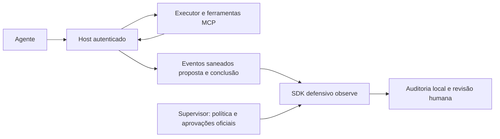

# Arquitetura e onboarding do piloto defensivo

MCP transporta chamadas/descrições/resultados; não atribui por si a autoridade da política de negócio. O host autentica a sessão e deriva tenant, principal, producer e scopes fora do payload observado. Conteúdo da ferramenta e texto do agente não instalam políticas nem emitem aprovação confiável.

O host possui controles de execução próprios. O caminho de observação saneado não muda a autorização do executor. Um guard do host pode usar decisões em outro experimento, mas isso não está autorizado no shadow deste kit. Diagrama é arquitetura de integração a realizar, não alegação de conector universal já instalado.

## Passos concretos

1. Identificar o artefato: versão, commit/hash, dependências e ambiente de teste. Usar o pacote isolado e casos reproduzíveis fornecidos; registrar os comandos efetivamente executados, não só planejados.
2. Escolher um fluxo e uma allowlist de campos: identificadores opacos, ferramenta, tipo, recurso autorizado, horários, resultado estruturado e sumário minimizado. Dados brutos financeiros ou segredos não são requisito de instalação.
3. Definir a política oficial do tenant: missão, regras exatas de ferramentas/recursos, versão ativa e aprovação exigida. O supervisor/administrador autorizado registra a política; ferramentas observadas não viram automaticamente ferramentas autorizadas.
4. Mapear contexto confiável e pontos de eventos. ActionProposed corresponde à intenção anterior à chamada; ActionCompleted vem do executor e vincula proposal_event_id/action_id/agente. Eventos ausentes deixam cobertura incompleta.
5. Vincular aprovações pelo hash canônico da ação e política, ator competente, expiração e revogação. Não registrar como aprovada uma frase no resultado de ferramenta. Relógio do host é a fonte temporal de avaliação; replay usa relógio explicitamente controlado pelo operador.
6. Instanciar DefenseEvaluator com provider e limites acordados de TTL/trajetórias/eventos/payload. Chamadas serializadas; não assumir segurança de threads. Experimentar perda de contexto e restart antes do teste final.
7. Configurar auditoria e acesso. JSONL e journal local são opções; registrar falha de gravação. Hashes ajudam rastreabilidade, mas não substituem controle de acesso, proteção do host ou assinatura externa. Retenção/rotação/tamanho do arquivo pertencem ao plano operacional.
8. Rodar casos de laboratório e conferir efeitos pelo executor. Congelar versões e iniciar avaliação independente. Só configurar shadow depois dos gates e das autorizações preenchidas.

## Verificação de integração

|Verificação|Evidência exigida|
|---|---|
|Tenant/producer/scopes fora do payload|Registro do ponto de autenticação e teste negativo|
|Evento duplicado/conflitante|Decisão histórica estável; conflito explícito|
|Permissão ausente/atualização de política|Insuficiência ou violação conforme evidência; nenhum downgrade do agente|
|Aprovação expirada/revogada|Resultado não tratado como autorização vigente|
|Resultado textual tenta mudar regras|Política oficial continua a mesma|
|Limite de estado/reinício|Contexto perdido explícito e comportamento registrado|
|Falha de auditoria|Erro visível; decisão não alterada para parecer normal|
|Desligamento do avaliador|Fluxo do host conserva seu controle de execução|

Saída de onboarding: mapa do host/executor, política/hash, mapeamento, limites, trilha dos testes e pendências. Se o runtime só permite logs posteriores, entregar esse limite com o piloto; não prometer ponto preventivo que o ambiente não expõe.
