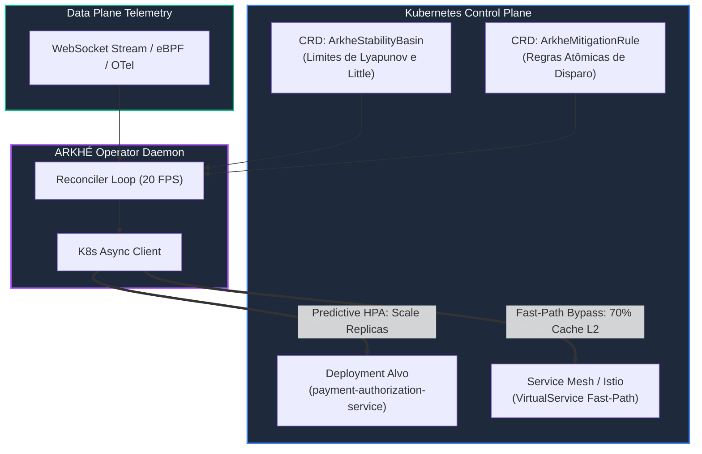

# ☸️ ARKHÉ Kubernetes Operator: Resiliência Cibernética Declarativa (v1alpha1)

O **ARKHÉ Kubernetes Operator** transforma a teoria matemática de **Estabilidade de Lyapunov** e **Controle em Malha Fechada (Closed-Loop)** em recursos nativos e declarativos do ecossistema Kubernetes.

---

## 🏗️ Arquitetura do Operador



---

## 📦 Componentes do Pacote

1. **Custom Resource Definitions (CRDs):**
   * [`k8s/crds/resilience.arkhe.io_arkhestabilitybasins.yaml`](file:///c:/Users/anonimo/OneDrive/Documentos/GitHub/arkhe-benchmark-lab/k8s/crds/resilience.arkhe.io_arkhestabilitybasins.yaml): Governa os limites de Lyapunov ($\rho$, $W_q/W_s$, $TTC$) e as estratégias de mitigação.
   * [`k8s/crds/resilience.arkhe.io_arkhemitigationrules.yaml`](file:///c:/Users/anonimo/OneDrive/Documentos/GitHub/arkhe-benchmark-lab/k8s/crds/resilience.arkhe.io_arkhemitigationrules.yaml): Regras condicionais atômicas para disparo de ações personalizadas.
2. **Motor do Controlador (`k8s/operator/`):**
   * `models.py`: Modelos de dados fortemente tipados para as CRDs.
   * `k8s_client.py`: Cliente assíncrono para K8s API com suporte a ServiceAccount in-cluster e modo mock.
   * `reconciler.py`: Loop de reconciliação de estabilidade estocástica e auto-atuação.
   * `main.py`: Ponto de entrada do daemon com graceful shutdown.
   * `rbac.yaml`: ServiceAccount, ClusterRole e ClusterRoleBinding com permissões mínimas necessárias.
   * `Dockerfile`: Container enxuto baseado em Python 3.12-slim.
3. **Exemplos Declarativos (`k8s/examples/`):**
   * [`k8s/examples/stability-basin-payments.yaml`](file:///c:/Users/anonimo/OneDrive/Documentos/GitHub/arkhe-benchmark-lab/k8s/examples/stability-basin-payments.yaml): Exemplo completo de proteção de pipeline de pagamentos.
   * [`k8s/examples/mitigation-rule-hpa.yaml`](file:///c:/Users/anonimo/OneDrive/Documentos/GitHub/arkhe-benchmark-lab/k8s/examples/mitigation-rule-hpa.yaml): Exemplo de regra atômica de auto-scaling preditivo.

---

## 🚀 Como Implantar no Cluster

### 1. Aplicar as CRDs e Permissões RBAC
```bash
# 1. Registrar as CRDs no cluster Kubernetes
kubectl apply -f k8s/crds/

# 2. Criar namespace do operador e aplicar RBAC
kubectl create namespace arkhe-system
kubectl apply -f k8s/operator/rbac.yaml
```

### 2. Declarar a Bacia de Estabilidade do Workload
```yaml
apiVersion: resilience.arkhe.io/v1alpha1
kind: ArkheStabilityBasin
metadata:
  name: core-payments-basin
  namespace: payments-prod
spec:
  workloadRef:
    kind: Deployment
    name: payment-authorization-service
  stabilityConstraints:
    maxRhoBasin: 0.50               # Ocupação máxima admissível
    maxQueueWaitRatio: 0.25          # Limite de fila Little
    criticalTimeToCollapseSeconds: 30 # Disparo se TTC < 30s
  mitigation:
    predictiveHpa:
      enabled: true
      minReplicas: 3
      maxReplicas: 60                # Escala até 60 réplicas em milissegundos
      scaleMultiplier: 2.0
    fastPathBypass:
      enabled: true
      trafficBypassRatio: 0.70       # Roteia 70% p/ cache L2 (12ms)
```

Aplicar o manifesto:
```bash
kubectl apply -f k8s/examples/stability-basin-payments.yaml
```

### 3. Verificar o Status em Tempo Real via Kubectl
```bash
kubectl get arkhestabilitybasin -n payments-prod
```
Saída esperada:
```
NAME                  WORKLOAD                         STATUS           RHO LIMIT   CURRENT RHO   TTC           AGE
core-payments-basin   payment-authorization-service    LaminarHealthy   0.50        0.0839        ESTÁVEL (∞)   42s
```

---

## 🧪 Validação dos Testes Automatizados

Para executar a suite de testes unitários e de integração do operador:
```bash
python -m unittest tests/test_k8s_operator.py
```
Resultado:
```
----------------------------------------------------------------------
Ran 4 tests in 0.326s

OK
```
