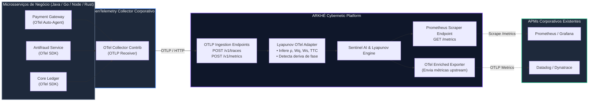

# 🔭 ARKHÉ OpenTelemetry (OTel) Native Connector & Exporter

O **ARKHÉ OpenTelemetry Connector** viabiliza a adoção corporativa com **Zero-Touch Instrumentation**: microsserviços já instrumentados com OpenTelemetry (Java Agent, Go SDK, Python SDK, .NET) enviam spans e métricas padrão para o ARKHÉ sem que nenhuma linha de código de negócio precise ser alterada.

---

## 🏗️ Arquitetura do Conector OTel



---

## 🔌 Endpoints Disponíveis

| Endpoint | Método | Protocolo | Descrição |
| :--- | :---: | :---: | :--- |
| `/v1/traces` | `POST` | OTLP/HTTP JSON | Recebe lotes de spans padrão OpenTelemetry (`resourceSpans`). |
| `/v1/metrics` | `POST` | OTLP/HTTP JSON | Ingestor de métricas OTLP de infraestrutura. |
| `/metrics` | `GET` | OpenMetrics / Prometheus | Raspagem padrão de métricas enriquecidas com o score ARKHÉ. |
| `/v1/arkhe/metrics` | `GET` | OpenMetrics / Prometheus | Alias compatível para scraping customizado. |

---

## 📊 Métricas Enriquecidas Exportadas pelo ARKHÉ

Quando o Prometheus ou o Datadog Agent raspa o endpoint `/metrics`, o ARKHÉ expõe as variáveis cibernéticas de estabilidade:

| Métrica Prometheus | Tipo | Significado no Negócio |
| :--- | :---: | :--- |
| `arkhe_sentinel_risk_score` | `Gauge` | Score de risco preditivo da IA ARKHÉ ($0$ a $100$). |
| `arkhe_lyapunov_pool_utilization_rho` | `Gauge` | Taxa de ocupação de recursos críticos ($\rho \in [0, 1]$). |
| `arkhe_lyapunov_queue_wait_service_ratio` | `Gauge` | Razão entre tempo de espera e serviço ($W_q / W_s$). |
| `arkhe_lyapunov_d_rho_dt_per_min` | `Gauge` | Velocidade de saturação de fase ($\frac{d\rho}{dt}$ por minuto). |
| `arkhe_predicted_time_to_collapse_seconds` | `Gauge` | Projeção do Tempo até o Colapso ($TTC$). |
| `arkhe_closed_loop_mitigation_active` | `Gauge` | Flag ($0$ ou $1$) indicando auto-mitigação ativa. |
| `arkhe_closed_loop_fast_path_active` | `Gauge` | Flag ($0$ ou $1$) indicando desvio para cache L2. |
| `arkhe_sre_sli_availability_percent` | `Gauge` | SLI de disponibilidade real segundo o Google SRE framework. |
| `arkhe_sre_error_budget_remaining_percent` | `Gauge` | Saldo restante do Error Budget ($100\%$ a $0\%$). |
| `arkhe_sre_burn_rate` | `Gauge` | Velocidade de consumo do Error Budget ($0.0\times$ a $50.0\times$). |

---

## 🛠️ Configuração do OpenTelemetry Collector

Para encaminhar spans do seu OTel Collector corporativo para o ARKHÉ, basta adicionar o exporter OTLP no `otel-collector-config.yaml`:

```yaml
exporters:
  otlphttp/arkhe:
    endpoint: "http://arkhe-card-auth-lab-service:8080"

service:
  pipelines:
    traces:
      receivers: [otlp]
      processors: [batch]
      exporters: [otlphttp/arkhe, otlp/datadog]
```

---

## 🧪 Validação dos Testes

Execução da suite de testes automatizados do conector OTel:
```bash
python -m unittest tests/test_otel_connector.py
```
Resultado:
```
----------------------------------------------------------------------
Ran 5 tests in 0.143s

OK
```
