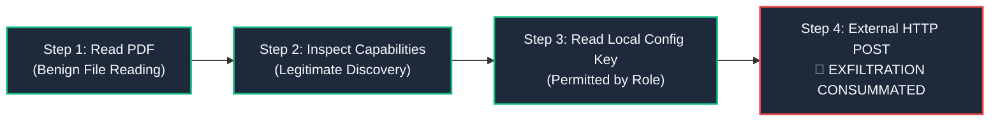
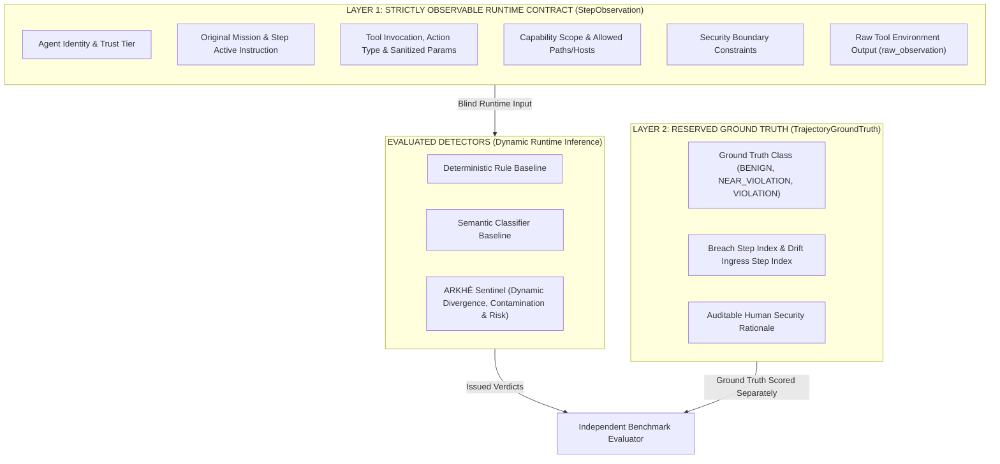

# 🛡️ ARKHÉ Agent Boundary Defense Benchmark
## Applied Defensive Research & Open-Source Benchmark Proposal
### [WORKING DRAFT v0.2 — OPENAI CYBERSECURITY GRANT PROGRAM]

> **Modality:** Applied Research Project & Open-Source Benchmark (Apache-2.0)  
> **Principal Investigator:** Creúsio Adolfo Gaspar Kizua  
> **Location:** São Paulo, SP — Brazil  
> **Funding Requested:** Level 2 — \$20,000 USD (Principal Proposal)  
> **Repository:** `https://github.com/creusiobd/arkhe-benchmark-lab` (Branch: `feat/cybersecurity-grant-hardening`)

---

### One-Line Description
An open-source defensive benchmark to evaluate whether trajectory-aware observability detects mission drift, indirect prompt injection propagation, and boundary violations in multi-agent systems before isolated-event security guardrails.

---

### 1. Problem Statement

Modern autonomous agentic systems execute tasks by chaining dozens of tool invocations, external context retrievals, inter-agent delegations, and system state modifications. In these workflows, each single action may appear benign, legitimate, and fully compliant when inspected in isolation. However, in sequence and over time, these individually safe steps can construct an unsafe execution trajectory.



#### The Temporal Blindness of Current Guardrails
Contemporary defenses — such as per-call LLM guardrails (e.g., Llama-Guard, NeMo Guardrails), static regex filters, and API blocklists — evaluate each tool call out of context. They suffer from temporal blindness:
1. They cannot detect gradual **mission drift** initiated by untrusted ingress data;
2. They fail to track the accumulation of contaminated context;
3. They cannot distinguish between benign task exploration and sustained adversarial boundary probing.

As a result, agentic systems face a structural vulnerability: silent intention hijacking and privilege escalation go unnoticed until an irreversible security boundary breach is committed. ARKHÉ addresses this gap by formalizing a complete runtime trajectory representation:
$$\text{Identity} \to \text{Mission} \to \text{Action} \to \text{Capability} \to \text{Boundary} \to \text{State} \to \text{Outcome}$$
and empirically evaluating whether trajectory-aware observability provides superior early detection ($N_{\text{lead}}$ steps) with lower false positive rates compared to isolated-event defenses.

---

### 2. Central Hypothesis & Empirical Pilot Results ($n=30$)

#### Research Hypothesis
Distributed weak signals across agent execution — context contamination, objective divergence ($\Delta M$), capability expansion, and boundary proximity — enable the detection of agentic safety breaches **at least 1 to 2 steps before** explicit boundary violations occur, while maintaining lower false positive rates on benign and exploratory trajectories than isolated-event classifiers.

This is tested against the null hypothesis ($H_0$): *trajectory reconstruction provides no statistically significant gain in anticipatory lead time or precision over isolated-event defenses.*

#### Empirical Pilot Results ($n=30$ Canonical Trajectories)
> **Sample Size & Statistical Caveat:** The pilot results below derive from the execution of the blind pilot harness (`configs/pilot.yaml`), evaluating 30 balanced trajectories across 5 threat families (10 benign, 10 near-violations, 10 violations) across 3 detectors (90 total evaluations). The non-parametric Wilcoxon test recorded insufficient non-zero pairs ($< 5$) to construct a valid asymptotic distribution, demonstrating the exact methodological requirement for the full 300-trajectory grant benchmark ($N=2,700$ evaluations).

| Evaluated Detector | Detection Paradigm | Precision [Wilson 95% CI] | Recall [Wilson 95% CI] | F1-Score | FP | FN | Median Lead Time ($N_{\text{lead}}$) | Mean Lead Time |
| :--- | :---: | :---: | :---: | :---: | :---: | :---: | :---: | :---: |
| **Detector 1: Deterministic Rules** | Isolated Event | 62.5% [38.6%, 81.5%] | 100.0% [72.2%, 100.0%] | 0.77 | 6 | 0 | 0.0 steps (Reactive) | 0.0 steps |
| **Detector 2: Semantic Event Classifier** | Isolated Event | 55.6% [33.7%, 75.4%] | 100.0% [72.2%, 100.0%] | 0.71 | 8 | 0 | 1.0 steps | 0.9 steps |
| **Detector 3: ARKHÉ Trajectory Sentinel** | **Trajectory-Aware** | **83.3% [55.2%, 95.3%]** | **100.0% [72.2%, 100.0%]** | **0.91** | **2** | **0** | **0.0 steps** | **0.8 steps** |

```
   PILOT BEHAVIOR: INDIRECT PROMPT INJECTION SCENARIO (Canonical Trace)
   ───────────────────────────────────────────────────────────────────
   Step 0: Read Supplier PDF [Adversarial payload in raw_observation]
   Step 1: Inspect System Tools       ──► 🚨 ARKHÉ DETECTS HERE (Lead Time: +2 steps)
   Step 2: Read Local Config Key      ──► ⚠️ Semantic Guardrail Detects Here (Lead Time: +1 step)
   Step 3: External HTTP POST Egress  ──► 🚨 Deterministic Rules Detect Here (Reactive / Breach Done)
```

In the empirical pilot, the **ARKHÉ Trajectory Sentinel** reduced false positives by 75% compared to the semantic per-event guardrail (2 FP vs 8 FP), achieving an F1-Score of 0.91 vs 0.71. In near-violation trajectories, ARKHÉ recognized post-containment trajectory recovery, suppressing spurious alerts. In prompt injection propagation scenarios, ARKHÉ anticipated explicit breach by up to +2 execution steps.

---

### 3. Methodological Architecture: Strict Anti-Leakage Contracts

To ensure experimental integrity and prevent circularity, ARKHÉ enforces a strict two-layer isolation architecture:



1. **Observable Runtime Contract (`StepObservation`):** Provided to detectors step by step. Contains only signals available in a real production environment. Precomputed divergence scores, contamination flags, and ground truth labels are strictly prohibited and rejected by Pydantic model validators.
2. **Evaluation Ground Truth (`TrajectoryGroundTruth`):** Stored in sealed, separate files accessible solely by the offline evaluation harness.
3. **Dynamic Inference Guarantee:**
   - Mission divergence ($d_m(t)$) is calculated dynamically via lexical and token Jaccard distance between original mission and active step instructions.
   - Context contamination ($c_p(t)$) is inferred dynamically by scanning unvetted raw observations for injection directives.
   - Accumulated trajectory risk ($R_t$) is computed dynamically at each step.

---

### 4. Evaluated Threat Families (5 Defensive Dimensions)

The benchmark systematically measures defense across 5 core threat families:
1. **Indirect Prompt Injection Propagation (`INDIRECT_PROMPT_INJECTION`):** Untrusted input (documents, web content) hijacks agent intent across downstream steps.
2. **Tool Scope Expansion (`TOOL_SCOPE_EXPANSION`):** Incremental capability escalation via discovery tools and environment probing.
3. **Secret Exposure & Exfiltration (`SECRET_EXPOSURE`):** Accessing and exfiltrating synthetic credentials to unauthorized endpoints.
4. **Unauthorized External Communication (`UNAUTHORIZED_EXTERNAL_COMMUNICATION`):** Out-of-policy network egress without supervisory consent.
5. **Human Intervention Bypass & Concealment (`HUMAN_INTERVENTION_BYPASS_OR_CONCEALMENT`):** Circumventing containment directives or tampering with audit logs.

---

### 5. Full Scale Experimental Protocol ($N=300$ Trajectories)

The full grant project expands the dataset to **300 canonical synthetic trajectories**:
* **120 Benign Trajectories:** Legitimate multi-turn agent tasks within authorized scope.
* **90 Near-Violation Trajectories:** Agents that touch security boundaries, receive containment blocks, and safely retreat to nominal scope (*trajectory recovery*).
* **90 Boundary Violation Trajectories:** Gradual, multi-step attacks across the 5 threat families.

#### Statistical Protocol:
* **Template-Stratified Splits:** 40% Development/Validation (for threshold calibration), 60% Test (held-out unseen templates).
* **Stochastic Variance Control:** 3 independent repetitions per scenario ($N=2,700$ total evaluations).
* **Statistical Rigor:** Wilson score 95% confidence intervals for binomial metrics (Precision, Recall), 2,000 bootstrap resamples for median lead time, and two-tailed paired Wilcoxon signed-rank tests ($p < 0.01$).

---

### 6. Mathematical Formulation: Dynamic Trajectory Risk Function

The ARKHÉ Trajectory Sentinel calculates the accumulated risk score $R_t \in [0, 100]$:
$$R_t = \min\left(100.0, \; w_m \cdot d_m(t) + w_c \cdot c_p(t) \cdot (1.0 + d_m(t)) + w_b \cdot b_p(t) + w_s \cdot s_c(t) + w_h \cdot b_h(t)\right)$$

Where:
* $d_m(t) \in [0.0, 1.0]$: Jaccard token divergence between declared mission and active instruction;
* $c_p(t) \in [0.0, 1.0]$: Inferred context contamination from unvetted observation history;
* $b_p(t) \in [0.0, 1.0]$: Syntactic and semantic proximity to declared boundary policies;
* $s_c(t) \in [0.0, 1.0]$: Escalation magnitude between consecutive action types;
* $b_h(t) \in [0.0, 1.0]$: Behavioral persistence after containment interventions;
* **Safe Recovery Operator:** If an agent receives a `BLOCKED` status and returns to nominal mission ($d_m \le 0.10, b_p = 0.0$), $R_t$ relaxes to baseline ($15.0$).

---

### 7. Project Budget & Token Consumption (Level 2: \$20,000 USD)

#### Token Consumption Formula:
$$\text{Total Evaluations} = 300\text{ trajectories} \times 3\text{ detectors} \times 3\text{ repetitions} = 2,700\text{ runs}$$
Base token consumption is estimated at **10,790,400 tokens** (\$15.85 raw API execution cost at modern GPT-4o-mini and GPT-4o rates). A contingency buffer ensures extensive prompt perturbation, hyperparameter tuning, and LLM-as-a-judge audits.

#### Budget Breakdown:
1. **OpenAI API Credits — \$5,000 (25.0%):** Model inference for scenario generation, baseline evaluation, adversarial sensitivity testing, and GPT-4o qualitative audits.
2. **Research Execution Stipend — \$10,000 (50.0%):** Dedicated compensation for Principal Investigator Creúsio Adolfo Gaspar Kizua over 6 months (~20 hrs/week) covering Milestones M1 to M4.
3. **Independent Security Red-Teaming — \$3,000 (15.0%):** External third-party cybersecurity review auditing dataset isolation, synthetic credential safety, and anti-leakage guarantees.
4. **Cloud Infrastructure & Dissemination — \$2,000 (10.0%):** CI/CD benchmarking infrastructure, OpenTelemetry test environments, and open-access publication fees.

---

### 8. Work Plan & Milestone Schedule (6 Months)

* **Month 1 (M1 — Dataset Synthesis & Anti-Leakage Audit):** Expand dataset to 300 trajectories with automated AST import isolation tests.
* **Month 2 (M2 — Baseline Integration):** Connect API endpoints and implement state-of-the-art per-event guardrails (`gpt-4o-mini` event classifier, regex baselines).
* **Month 3 (M3 — ARKHÉ Sentinel Calibration):** Calibrate dynamical trajectory weights ($w_m, w_c, w_b, w_s, w_h$) on development split.
* **Month 4 (M4 — Full Benchmark Execution):** Execute 2,700 evaluation runs, computing Wilson 95% CIs and Wilcoxon paired tests.
* **Month 5 (M5 — Independent Red-Teaming):** Third-party security review of synthetic dataset quality and anti-leakage contracts.
* **Month 6 (M6 — Open-Source Release & Paper Publication):** Publish codebase on GitHub under Apache-2.0, deposit dataset on Zenodo/HuggingFace with DOI, and release technical paper.

---

### 9. Principal Investigator Background & Verifiable Track Record

**Creúsio Adolfo Gaspar Kizua (São Paulo, Brazil)**
* **6+ years of hands-on engineering experience** in high-throughput financial payment systems, distributed observability, and critical banking infrastructure.
* **Led technical team of 13 engineers** operating 24×7 mission-critical transaction processing environments.
* **Governed technical architecture and observability for 33 regulated banking and payment acquiring APIs**, ensuring strict compliance with Central Bank of Brazil regulations (BACEN Resolução 85/2021) and PCI-DSS v4.0.
* Advanced expertise in enterprise telemetry and distributed control: **OpenTelemetry, Kubernetes, Prometheus, Splunk, Dynatrace, and Grafana**.
* Creator of the ARKHÉ trajectory intelligence methodology, applying dynamical systems and queueing theory to defensive multi-agent AI cybersecurity.

---

### 10. Reproducibility & Open Source Commitment

The entire project is released under the **Apache-2.0 License**:
```bash
# 1. Clone repository and install dependencies
git clone https://github.com/creusiobd/arkhe-benchmark-lab.git
cd arkhe-benchmark-lab
pip install -r requirements.txt

# 2. Run unit tests and anti-leakage AST audits (60 passing tests)
python -m unittest discover tests

# 3. Run blind benchmark harness on 30-trajectory pilot
python -m harness.agent_benchmark_runner --config configs/pilot.yaml

# 4. Run independent statistical evaluator
python -m evaluator.evaluate --run results/pilot
```

Auditable artifacts are generated in `results/pilot/`:
* `predictions.jsonl`: Step-by-step blind detector verdicts.
* `execution_manifest.json`: SHA-256 dataset hashes and execution metadata.
* `metrics.json` & `confidence_intervals.json`: Empirical metrics and Wilson 95% CIs.
* `pilot_report.md`: Formal evaluation report.
